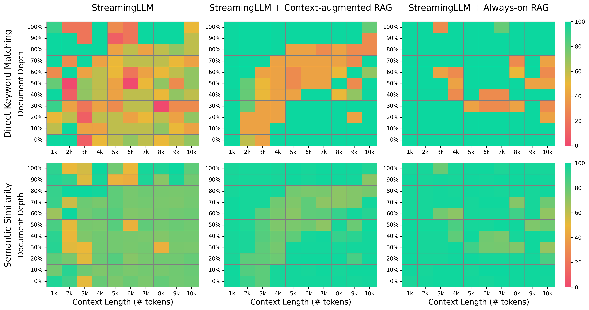

# Extending Context-Awareness in StreamingLLM with Retrieval-Augmented Generation
[[report](assets/report.pdf)] [[poster](assets/poster.pdf)] [[video](https://youtu.be/xIBHok1K6T8)]

## Demonstration
https://github.com/user-attachments/assets/6ba5e74f-d61b-4756-acc9-73849d2c0c6c

## Benchmarking


## TL;DR
We deploy LLMs for infinite-length inputs without sacrificing efficiency and performance. By integrating Retrieval-Augmented Generation (RAG), we extend context capabilities while preserving relevance and optimizing memory usage.

## Key Features

- Infinite-length input handling with optimized memory.
- Retrieval-Augmented Generation (RAG) integration for extended context and relevance.
- Efficient token eviction and retrieval mechanisms.

## Abstract
Deploying Large Language Models (LLMs) in streaming applications such as multi-round dialogue, where long interactions are expected, poses challenges of memory consumption and limited context. StreamingLLM addresses these issues through attention sinks and now integrates RAG to dynamically retrieve evicted information, enabling coherent long-context processing.

## Usage

### Environment Setup

```bash
conda create -yn streaming python=3.8
conda activate streaming

pip install torch torchvision torchaudio
pip install transformers==4.33.0 accelerate datasets evaluate wandb scikit-learn scipy sentencepiece
pip install chromadb 
pip install needlehaystack

python setup.py develop
```

### Run Streaming Llama with RAG

```bash
python examples/run_streaming_llama.py \
   --enable_streaming \
   --model_name_or_path meta-llama/Llama-2-7b-chat-hf \
   --enable_retriever \
   --enable_always_retriever \
   --chunk_size 100 \
   --recent_size 4096 \
   --file_path data/prompt_context_length_6000_depth_percent50.json
```

## Setup

- **Hardware**: All tests were conducted on a MacBook with an M4 Max chip and 128 GB unified memory.
- **Visualization**: A heatmap visualization of attention sinks and retrieval patterns is available in `/streaming-llm/visualization/heatmap.ipynb`.
- **Commands**: All commands used to run the experiments are saved in `/streaming-llm/results/overnight.sh`.

## FAQ

1. **What does "working on infinite-length inputs" imply for LLMs?**
   Handling infinite-length text with LLMs presents challenges. StreamingLLM retains recent tokens and attention sinks while integrating RAG to retrieve and reintroduce evicted context dynamically.

2. **How does RAG enhance StreamingLLM?**
   By incorporating RAG, StreamingLLM retrieves relevant evicted information from external storage and integrates it into the input prompt, extending effective context length without increasing memory overhead.

3. **What is the ideal use case for StreamingLLM with RAG?**
   Multi-round dialogues, real-time assistants, or any application requiring coherent and efficient long-context processing.


## Citation
The original StreamingLLM paper can be cited as,
```bibtex
@article{xiao2023streamingllm,
        title={Efficient Streaming Language Models with Attention Sinks},
        author={Xiao, Guangxuan and Tian, Yuandong and Chen, Beidi and Han, Song and Lewis, Mike},
        journal={arXiv},
        year={2023}
        }
```
